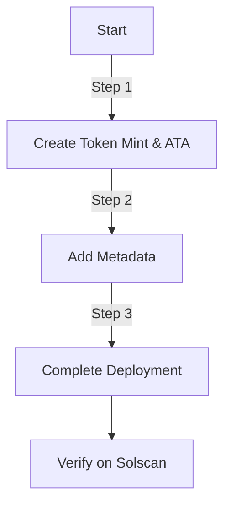

# 🌟 ONDRIX Fixed Supply Token on Solana

## 📖 Overview

The **ONDRIX** token is a fixed-supply token on the Solana blockchain, built using the **SPL Token program**. With a total supply of **500,000,000 tokens** (9 decimals) and a permanently revoked mint authority, ONDRIX ensures immutability and security. This README provides detailed documentation for the token's smart contract, deployment process, metadata configuration, and verification steps.

### 🎯 Token Details

| Property             | Value                                                                                                                        |
| -------------------- | ---------------------------------------------------------------------------------------------------------------------------- |
| **Name**             | ONDRIX                                                                                                                       |
| **Symbol**           | ONDRIX                                                                                                                       |
| **Total Supply**     | 500,000,000 tokens (immutable)                                                                                               |
| **Decimals**         | 9                                                                                                                            |
| **Mint Authority**   | Permanently revoked                                                                                                          |
| **Freeze Authority** | None                                                                                                                         |
| **Metadata URI**     | [IPFS Link](https://gold-secondary-clam-627.mypinata.cloud/ipfs/bafkreicjzvl6rqk2lsbmzji4427kimo7fqmn4s4iehkmh7do5b3njjwjli) |
| **Program ID**       | `AXN9Tp8NXBcucP2TJBmSRL8VDTB4BYEtBGnsBsh9r1BX`                                                                               |

### ✨ Key Features

* 🔒 **Immutable Supply**: Mint authority is revoked post-deployment, ensuring no additional tokens can be created.
* 🛡️ **Secure Validation**: Comprehensive checks on account states and permissions.
* 📜 **Immutable Metadata**: Locked metadata via the Metaplex Token Metadata program.
* ⚙️ **Automated Workflow**: Script-based deployment for reliability and consistency.
* 🚀 **Mainnet Ready**: Configured for Solana mainnet with robust error handling.

---

## 🛠️ Prerequisites

To deploy the ONDRIX token, ensure the following are set up:

1. **Solana CLI**: [Install here](https://docs.solana.com/cli/install-solana-cli-tools)
2. **Rust**:

   ```bash
   rustup update stable
   ```
3. **Node.js**: Version 14.x or higher
4. **Funded Wallet**: At least 0.1 SOL in `~/.config/solana/id.json`
5. **Dependencies**:

   ```bash
   # Rust dependencies
   cargo install spl-token-cli
   cargo add solana-client solana-sdk spl-token spl-associated-token-account anyhow dotenv shellexpand

   # Node.js dependencies
   npm install @solana/web3.js @metaplex-foundation/mpl-token-metadata dotenv
   ```

---

## 🚀 Deployment Workflow

The deployment process consists of three steps:



---

## 📜 Smart Contract

The smart contract ensures secure, fixed-supply token behavior by minting the total supply and revoking the mint authority. It is written in Rust and available in the `process_instruction` function.

> See full contract in `/src/lib.rs`

### 🔐 Security Features

* **Authority Validation**: Ensures only authorized signers can execute transactions.
* **State Verification**: Checks account and mint validity.
* **Irreversible Revocation**: Mint authority revoked post-minting.

---

## 🛠️ Step-by-Step Deployment

### Step 1: Create Token Mint and Associated Account

Script: `create_token.rs`

```bash
cargo run --bin create_token
```

Expected output:

* ✅ Token created successfully
* 🔗 Solscan: [https://solscan.io/token/](https://solscan.io/token/)\<MINT\_ADDRESS>
* token\_info.env file generated with mint and token account info

---

### Step 2: Add Token Metadata

Script: `addMetadata.js`

```bash
node addMetadata.js <MINT_ADDRESS>
```

> Metadata stored on IPFS and includes name, symbol, image, and attributes.

Expected output:

* ✅ Metadata created successfully
* 🔗 View on Solscan
* 🔗 Transaction link

---

### Step 3: Complete Deployment

Script: `complete_deployment.rs`

```bash
cargo run --bin complete_deployment <MINT_ADDRESS>
```

Expected output:

* ✅ Deployment completed successfully
* Supply: 500,000,000 \* 10^9
* Mint Authority: None

---

## ✅ Post-Deployment Verification

View on:

* 🔗 [Solscan Token](https://solscan.io/token/<MINT_ADDRESS>)
* 🔗 [Solscan Transaction](https://solscan.io/tx/<TX_SIGNATURE>)

---

## 🛠️ Custom Error Codes

| Error Code | Description                  |
| ---------- | ---------------------------- |
| 6000       | Invalid mint state           |
| 6001       | Token account not empty      |
| 6002       | Mint authority not revoked   |
| 6003       | Token account owner mismatch |
| 6004       | Mint authority mismatch      |

---

## 🩺 Troubleshooting

| Issue                | Solution                               |
| -------------------- | -------------------------------------- |
| Insufficient SOL     | Fund wallet with ≥ 0.1 SOL             |
| Invalid mint state   | Recheck step 1 deployment              |
| Token account exists | Use existing ATA from `token_info.env` |
| Transaction timeout  | Retry with higher fee                  |
| Metadata failure     | Ensure IPFS link is accessible         |
| Program ID mismatch  | Check PROGRAM\_ID in code/scripts      |

---

## 🔍 Security Audit Summary (SecureV1.0)

* 🔒 Fixed Supply: Verified mint authority revocation
* 🛡️ Input Validation: Validates account states
* 🚨 Error Handling: Custom codes for failure cases
* 📜 Immutable Setup: 9 decimals, 500M fixed total supply

---

## 🖥️ Usage

* **Wallets**: Add token in Phantom or Solflare using mint address
* **Transfers**: Use SPL Token standard methods
* **Explorers**: Solscan or Solana Explorer

---

## 📜 License

This project is licensed under the MIT License. Based on the Solana SPL Token program.

